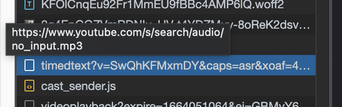

# Chrome Youtube Scraper Extension

### Table of Contents
- [Chrome Youtube Scraper Extension](#chrome-youtube-scraper-extension)
    - [Table of Contents](#table-of-contents)
    - [Pipeline](#pipeline)
    - [Requirements](#requirements)
    - [Development](#development)
    - [Deployment](#deployment)
    - [Testing](#testing)

### Pipeline
1. Chrome extension youtube recognition
2. Subtitle payload download(subtitle text, timestamp)
3. Video download & audio rip
4. Audio voice classification(https://medium.com/analytics-vidhya/speaker-identification-using-machine-learning-3080ee202920)
5. Audio voice & subtitle timestamp matching
6. Timestamp actors/agents/speaker labeling

### Requirements
1. homebrew
2. ffmpeg
3. chrome in development mode to enable extension
4. Audio classifier

### Development

### Deployment

### Testing

- Sample podcast: https://www.youtube.com/watch?v=SwQhKFMxmDY
- [Subtitle payload](docs/subtitle_payload.json)
```
// payload url
https://www.youtube.com/api/timedtext?v=SwQhKFMxmDY&caps=asr&xoaf=4&hl=ko&ip=0.0.0.0&ipbits=0&expire=1664054664&sparams=ip%2Cipbits%2Cexpire%2Cv%2Ccaps%2Cxoaf&signature=7253DC0E8B46118A44E8BF2BB8A23A9A22841834.CD2D9305E88B89836E2004E92B53503C514FDB46&key=yt8&lang=en&fmt=json3&xorb=2&xobt=3&xovt=3&cbrand=apple&cbr=Chrome&cbrver=104.0.5112.102&c=WEB&cver=2.20220921.08.00&cplayer=UNIPLAYER&cos=Macintosh&cosver=10_15_7&cplatform=DESKTOP
```
- 

- [Video payload](docs/video_payload.mp4)
  - Initial package sends all header data & video data
  - Following packages cannot be decoded w/o initial header data
- [Audio payload]() (Sometimes the payload is broken, needs testing)